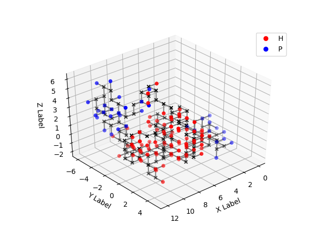

Elf Protein Structure Prediction - Parallel ABC Algorithm
===


Implementations of a Protein Structure Prediction (PSP) program, using an Artificial Bee Colony optimization algorithm.


Index
---


Overview
---

In this repository, I implement the protein structure prediction program described by Professor César Benítez and Professor Heitor Lopes in their article "Parallel Artificial Bee Colony Algorithm Approaches for Protein Structure Prediction Using the 3DHP-SC Model", whose complete reference is given below.

> Benítez, C.M.V. and Lopes, H.S., 2010. Parallel artificial bee colony algorithm approaches for protein structure prediction using the 3dhp-sc model. In Intelligent Distributed Computing IV (pp. 255-264). Springer, Berlin, Heidelberg.

The authors provide 2 parallelizations of a sequential PSP program that is described very thoroughly in their article. One of the parallelizations consist in splitting the work among nodes who communicate among themselves in a master-slave fashion; the other version (called Hybrid Hierarchical) splits the work among many master-slave systems, each of which work exactly the same way as the first parallelization described, and the masters communicate among themselves periodically in a ring logical topology. I only implemented the Hybrid Hierarchical version, because it can work exactly the same way as the master-slave version if you configure its parameters accordingly.

I've been investigating their proposal due to my research project, and during analysis I found out that I could greatly improve the execution time of the program by modifying one internal aspect of their algorithm. The modification consists on reducing the complexity of a hotspot of the algorithm, from O(n^2) to O(n). This resulted in the implementation of 4 different versions of the program:

- Sequential Quadratic: sequential version of the PSP algorithm, using the regular quadratic-complexity procedures;

- Sequential Linear: sequential version of the PSP algorithm, using the linear-complexity procedures I devised;

- Parallel Quadratic: Hybrid Hierarchical version of the PSP algorithm, using the regular quadratic-complexity procedures;

- Parallel Linear: Hybrid Hierarchical version of the PSP algorithm, using the linear-complexity procedures I devised.


Proposal for Complexity Reduction
---

The most compute-expensive portion of the PSP program implemented here is the calculation of the *free energy*, or *fitness*, of the proteins generated by the optimization algorithm. Within this procedure, the most costly calculations performed are counting collisions and counting contacts among beads (each aminoacid is made of 2 beads) of the protein. Both counting procedures involve the following sequential code:
```c
int collisions = 0;
int contacts   = 0;

for(i = 0; i < vecSize-1; i++){
	for(j = i+1; j < vecSize; j++){
		isEqual(vector[i], vector[j]){
			collisions += 1;
		}
		isNeighbor(vector[i], vector[j]){
			contacts += 1;
		}
	}
}
```
where *vector* is an array of beads in the tri-dimensional integer space; that is, each element in the vector is a structure containing 3 integers, one for each coordinate on each axis.

This sequential code has a lot of data parallelism, and many parallel algorithms have been devised to execute it, as can be seen in my ElfCudaLibs repository. However, when the size of `vector` is small enough (< 4K), there is a sequential approach that performs better than any parallel one. In the PSP problem, proteins rarely have more than 1000 aminoacids, so it makes sense to use the sequential approach rather than any parallel one. Below, I describe the sequential approach for counting collisions, but it should be fairly simple to derive the contact counting one from the description given.

Such sequential approach has O(n) complexity, instead of the O(n^2) seen in the basic sequential algorithm presented earlier. In this implementation we allocate a tri-dimensional array of *char*; the element *x,y,z* of this array should store how many beads there are in the position *x,y,z* in the tri-dimensional space. For this to work, we need:

1. The allocated array must be big enough to cover all possible locations of the beads;

2. The beads' coordinates must be integer values, i.e. the space where beads are located must be discrete.

In Protein Structure Prediction, many prediction algorithms, such as the one implemented here, model the protein as a set of connected beads whose coordinates are integers. Also, since the beads are connected, the space occupied by the protein is limited; that is, a protein with *N* beads can't exceed a space whose axes have dimensions of about *2 \* N*.

The steps of the algorithm are:

1. Allocate a tri-dimensional array of sufficient size;

2. For each bead in the vector, take the bead position *x,y,z* and set the element *x,y,z* of the array to 0;

4. Create a *collision* variable initialized to 0;

5. For each bead in the vector, take its position *x,y,z*, read the element *x,y,z* of the array in variable *K*, then

	1. increment *collision* in *K* units;

	2. increment the element *x,y,z* of the array in 1 unit;

Or, if you prefer some pseudo-code:

```python
V <- tri-dimensional array of sufficient size
collisions = 0

for bead in vector:
	V[bead.x][bead.y][bead.z] = 0

for bead in vector:
	K = V[bead.x][bead.y][bead.z]
	collisions += K
	V[bead.x][bead.y][bead.z] += 1
```

Each of the steps is *O(n)* so the whole procedure is also *O(n)*.


Requirements
---

You must be able to execute `gcc`, `mpicc` and `mpirun` from the command line.


Compiling
---

If you run `make`, it will make all the 4 program versions. The versions are called `parallel_lin`, `parallel_quad`, `seq_lin` and `seq_quad`, so you can make them separately, for example `make seq_lin`.

Usage
---

When you run `make`, 4 binary executable files will be built in the root of the directory. Two of them are sequential programs, and 2 are parallel. The sequential ones can be run as any other executable file

```
$ ./seq_lin
Usage: ./seq_lin HP_Sequence [num_cycles] [output file]
```

As you can see, the sequential versions receive 3 parameters on command line, 2 of which are optional. The `HP_Sequence` is a string of H and P characters, which represent the sequence of aminoacids of the protein whose structure you want predicted. These letters stand for "hydrophobic" and "polar" aminoacids. `num_cycles` refer to the number of cycles of the optimization algorithm, Artificial Bee Colony, and more cycles should result in better predictions. The `output file` is the filename of the file to which we should write the output of the program, whose format is described later. An example of usage and output is as follows:

```
$ ./seq_lin HHHPHPHHHHPHHPHPPHHHHH 10000
Fitness: 1848.198080
Hcontacts: 52
Collisions: 14
BBGyration: 1.453835
Time: 5.269768
```

where `Hcontacts` is the number of hydrophobic contacts in the structure predicted; `collisions`, the amount of collisions; and BBGyration, the gyration radius of the protein.

Unlike the sequential versions, the parallel versions should be executed using the `mpirun` command, like follows:

```
$ mpirun -n 4 ./parallel_lin HHHPHPHHHHPHHPHPPHHHHH 10000
Fitness: 1983.246602
Hcontacts: 42
Collisions: 8
BBGyration: 1.775057
Time: 4.688627
```

Output Format and Visualization
---

The predicted protein structure is saved in file `output.txt` by default, unless some filename has been specified as a command line argument. The format of the file is as follows:

```
[backbone bead 0]
[sidechain bead 0]
[backbone bead 1]
[sidechain bead 1]
[backbone bead 2]
[sidechain bead 2]
[...]
[backbone bead N]
[sidechain bead N]

[HP chain]
```

The structure can be visualized using a Python script provided in the `utils/` directory, as follows:

```
./utils/protein_vis.py output.txt figure.png
```

Which should show a GUI for visualizing and interacting with the protein structure. Besides that, an image is saved in the file specified on command line (`figure.png` in the example). You'll need `numpy` and `matplotlib` installed for running the Python script. An example of visualization is given below.



Configuring Internal Parameters
---

The program has a number of internal parameters (macros) that can be configured upon compilation. All the parameters can be checked in the file `src/config.h`.

For example, the default number of bees in the colony is 250, but say you want to change it to 1000. You can do it by running:

```
make clean
make DEFS="-D COLONY_SIZE=1000"
```

which will pass the "-D COLONY_SIZE=1000" flag to `gcc`; the "-D" option defines macros on command line. Note that `make clean` should be called before, or Makefile might claim that "all files are up to date" and won't build anything at all.
